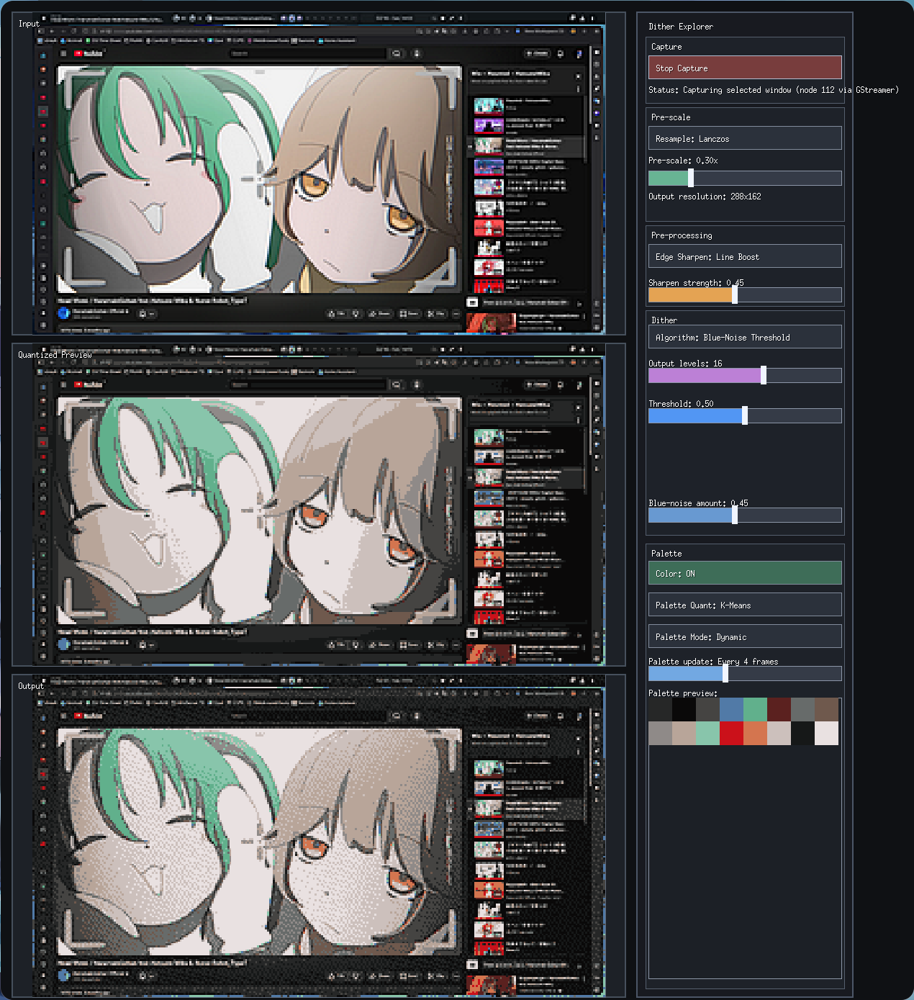

# Dither Explorer (Go + Ebitengine)

Basic GUI app for exploring dithering with a split layout:
- Left side: 3 stacked 16:9 screens (Input, Algorithm Preview, Output)
- Right side: controls sidebar with live capture + algorithm parameters

## Live capture mode

This app uses Linux desktop portal screen capture (system picker dialog) and consumes the selected PipeWire stream through GStreamer.

When you click **Start Capture**, your desktop environment should show the default system dialog to choose a window/source.

## Prerequisites (Linux)

- Go 1.23+
- GStreamer with PipeWire plugin (`gst-launch-1.0` + `pipewiresrc`)
- xdg-desktop-portal running in your desktop session

On many distros, ensure at least:
- `xdg-desktop-portal`
- the matching portal backend (for example `xdg-desktop-portal-gnome` or `xdg-desktop-portal-kde`)
- `gstreamer` and `gst-plugin-pipewire` packages

## Run

```bash
go run ./...
```

## Preview

Animated demo (excerpt from [here](https://www.youtube.com/watch?v=4ki6PwFu69Y)):


UI overview screenshot:




## Controls

- Start Capture / Stop Capture
- Algorithm selector dropdown: Threshold, Floyd-Steinberg, Bayer, Atkinson, JJN, Sierra, Blue Noise Threshold, Blue Noise Hybrid
- Color toggle (Color / B/W)
- Palette quantization dropdown: Uniform, Popular, Median Cut, K-Means
- Palette mode dropdown: Dynamic, Static
- Palette update interval slider (1, 2, 4, 8, 16, 32 frames when Dynamic mode is active)
- Resample dropdown: Nearest, Bilinear, Bicubic, Lanczos (default)
- Edge sharpen dropdown: None, Unsharp, Line Boost, Anime Edge
- Pre-scale slider (applies before dithering)
- Output resolution readout (under pre-scale)
- Output levels slider (snaps to 2, 4, 8, 16, 32, 64)
- Threshold slider
- Error Diffusion slider (shown for diffusion algorithms)
- Ordered strength slider (shown for Bayer)
- Blue-noise amount slider (shown for blue-noise algorithms)
- Click the Output panel to show output-only fullscreen in the window (no labels/sidebar); click anywhere to exit.

## Default startup settings

- Algorithm: Blue Noise Threshold
- Edge sharpen: Line Boost at 0.45 strength
- Palette mode: Dynamic
- Palette update interval: every 4 frames

## Notes

- Input is live capture only (no static image loading).
- If capture does not start, check app status text in the sidebar for portal or gstreamer errors.
